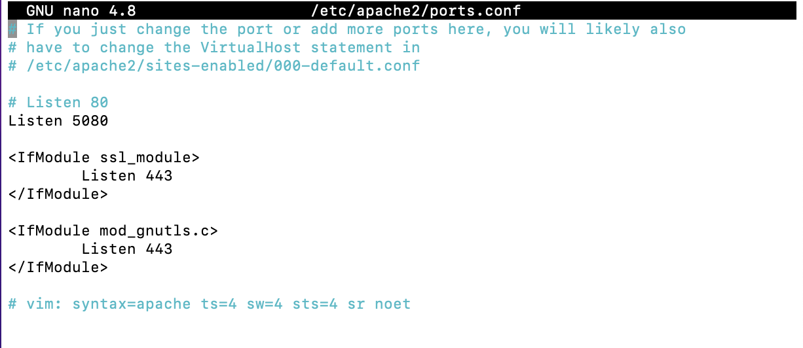
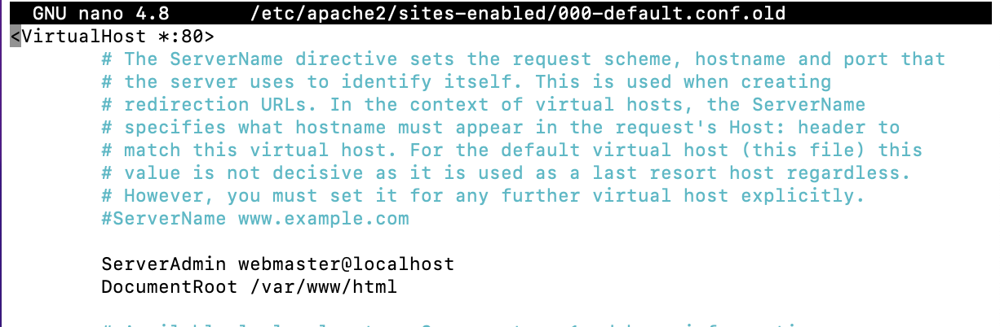
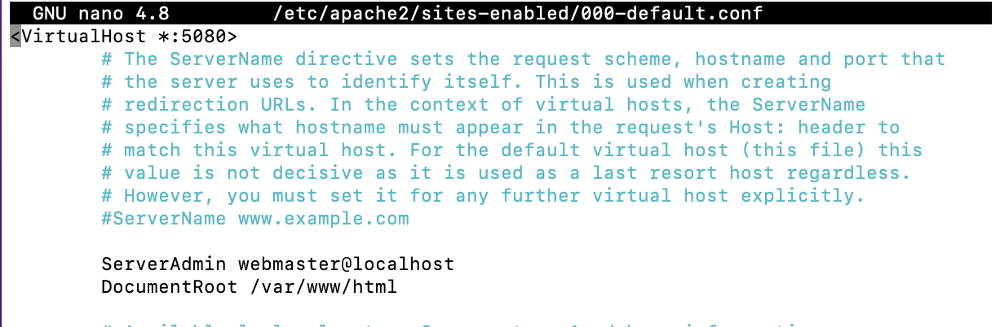
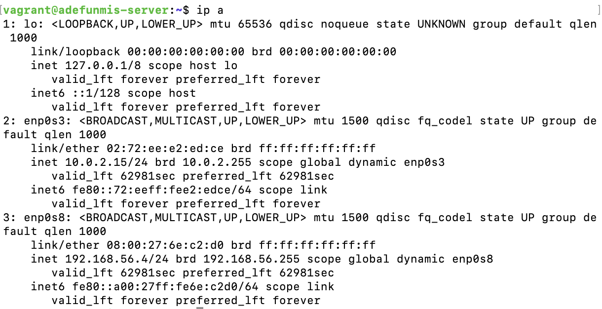
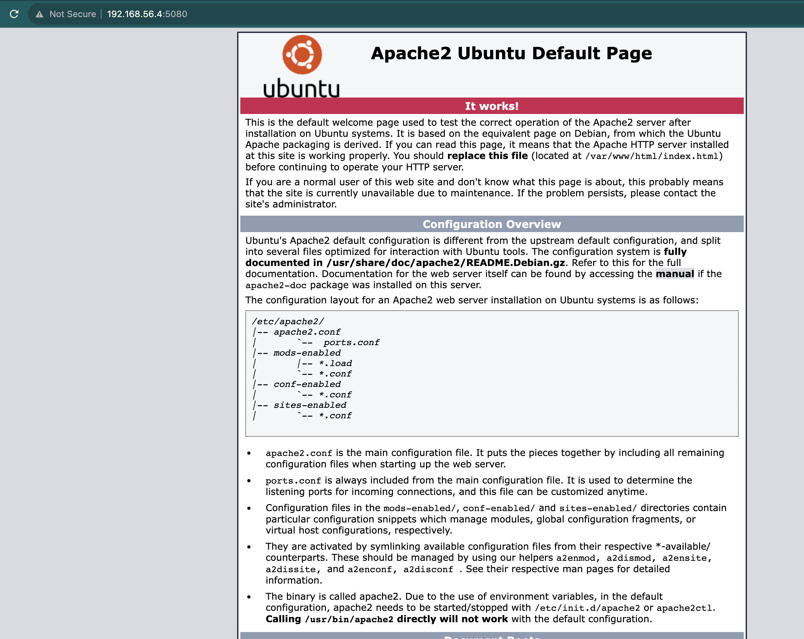
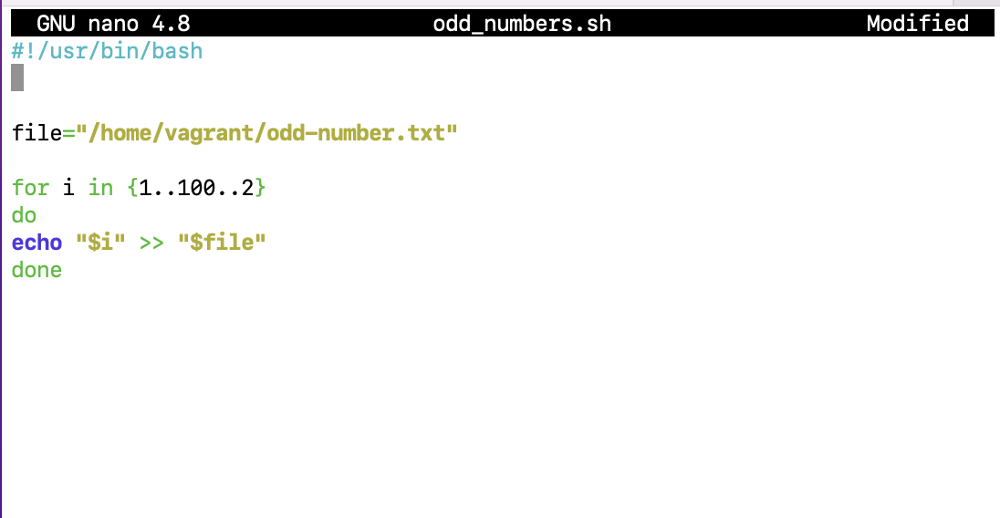
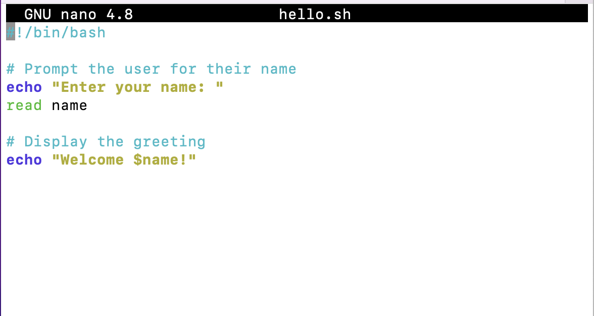

# Linux Assessment Solution

1. System's Routing Table
   On an Ubuntu Machine, you can access the system's routing table information with any of the following commands:

   - `ip route`
  
        

    - `route` or `route -n`
        The `-n` flag makes it output the IP addresses instead of grouping them by their hostnames. 

        

    - `netstat -rn`
        Here, the `-r` flag indicates that you want the routing table information from the netstat command while `-n` is the same as in the case of route.

        

    However, unlike the <b>`ip route`</b> command that works by default on Ubuntu, the <b>`route`</b> and <b>`netstat -rn`</b> commands that gave more refined output can be used by installing <b>`net-tools`</b> through the package manager.

    ### <b>Commands used:</b>

    ```
    sudo mkdir /Routing-Issue

    route -n | sudo tee /Routing-Issue/route
    ```

    ### Testing
    Check the content of the new file by running:

    ```
    cat /Routing-Issue/route
    ```

    


2. To get the hostname of Ubuntu VM:
   
    ```
    hostnamectl
    ```
    

    Note, I changed my hostname as described in the [networking.md file](./networking.md)

    Open the `/etc/hosts` file to become this:

    

    ### Testing
    To check if what we did was successful:

    ```
    nslookup 127.0.0.1

    OR

    nslookup <hostname>
    ``` 

    You will find the server's hostname in the first output or the IP address with the second command.


3. To change Apache server's listening port from default `80` to `5080`:

   - Open the `/etc/apache2/ports.conf` file in your favorite editor and comment out the line with `Listen 80` and add a new line, `Listen 5080` like this:

        ```
        sudo nano /etc/apache2/ports.conf
        ```

        

    - Edit the Apache VirtualHost file to start the binding process.

        ```
        sudo nano /etc/apache2/sites-enabled/000-default.conf
        ```

        Edit from this:
        

        To this:
        

    After this is done, you will need to restart the Apache Server with:

    ```
    sudo systemctl restart apache2
    ```

    ### Testing

    On the terminal, run:
    
    ```
    curl localhost:5080
    ```
    This will output the Apache default homepage.
    If you run `curl localhost`, it give an error.
    
     
    
    This can also be checked on your web browser by using this URL:
    
    ```
    http://<ip-address>:5080
    ```
    You can get the IP address of the server with the `ip addr` or `ip a` commands. Copy the address in the enp0s8 section: 

    

    The URL that you will use on your browser will be:

    ```
    http://192.168.56.4:5080
    ```

    


4. A bash script to display the odd numbers was written like this:

    ```
    #!/usr/bin/bash

    file="/home/vagrant/odd-number.txt"

    for i in {1..100..2}
    do
    echo "$i" >> "$file"
    done
    ```

    

5. A bash script to say "Welcome":

    ```
    #!/bin/bash

    # Prompt the user for their name
    echo "Enter your name: "
    read name

    # Display the greeting
    echo "Welcome $name!"
    ```

    

    ### Commands to execute bash scripts:

    ``` 
    sudo chmod +x <name-of-file>

    # This changes the permission of the file for execution

    ./file-name
    ```

    For example, a bash script named `welcome.sh` will be:

    ```
    sudo chmod +x welcome.sh

    ./welcome.sh
    ```


