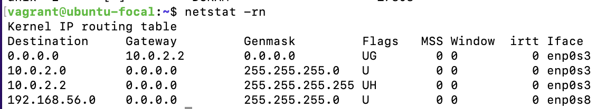

# Linux Assessment Solution

1. System's Routing Table
   On an Ubuntu Machine, you can access the system's routing table information with any of the following commands:

   - `ip route`
  
        

    - `route` or `route -n`
        The `-n` flag makes it output the IP addresses instead of grouping them by their hostnames. 

        

    - `netstat -rn`
        Here, the `-r` flag indicates that you want the routing table information from the netstat command while `-n` is the same as in the case of route.

        

    However, unlike the <b>`ip route`</b> command that works by default on Ubuntu, the <b>`route`</b> and <b>`netstat -rn`</b> commands that gave more refined output can be used by installing <b>`net-tools`</b> through the package manager.

    ### <b>Commands used:</b>

    ```
    sudo mkdir /Routing-Issue

    route -n | sudo tee /Routing-Issue/route

    cat /Routing-Issue/route
    ```

    