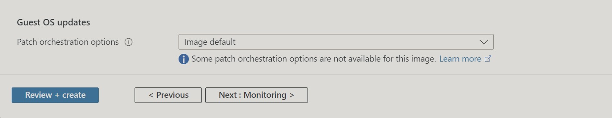

# **Introduction to Azure**

1. From the Azure Services page, click on `Create a Service`, 
   
   

   then, click the `create` link in the `Virtual machine section`.

2. The first page on the `Create a Virtual Machine` page required Basic details about the VM which included the VM name, Region, Availabilty zone, the image type, etc. For the image type, we picked `Ubuntu Server`.

    

    The authenticatication type selected was `SSH public key` and a new key pair would be generated for the VM.

    

    For the Inbound Port rules, we selected the `Allow selected ports` and added `Port 80 for HTTP requests` and `Port 22 for SSH connection`

    

3. The next page included configuration for the `Disks`. We left the default setting for the OS disk and we went on to attach additional 4GiB Premium SSD and specified that it should be deleted with the VM when we no longer need the VM (since it's for test purpose).

    
    

    Also, Having realized that we  could not find 5GiB of additional data disk, we decided to go for the 4GiB one.

    

4. Network Setting: We were instructed to use a private IP of /16 Subnet Mask. This is used to express the CIDR block range of addresses. Since the default subnet indicated in the network has /16, so we went with it.

    
    

5. Management: This helps to cinfigure the Autu-shutdown policy, Backup, OS updates, and Azure AD settings.

    
    
    

6. Monitoring: Enable Alert for CPU usage, Memory, Disk, etc.
    
    

    Alert Configured

    

7. In the Advanced Setting section, we included a [custom script](./custom-data.sh) to install `Apache2 server` and display `"Hello World from $(hostname -f)"`.

    

8. Added Tags:
    

9. Creating SSH key: On clicking the Create VM button, a pop-up shows to generate and download the ssh key to your local machine.

    

10. Webpage:

    

11. Alert Fired:
    

    Alert Resolved:
    


## **Connecting to the VM through SSH** 

1. Open your terminal and Navigate to the Download folder of the local machine (Using a MacOS system).

    ```
    cd Downloads
    ```

2. Ensure it has the right READ-ONLY permission it requires to work.

    ```
    chmod 400 <your-private-key-filename>
    ```

3. Copy the private key from your local machine to the remote server with this following command:
   
   ```
   ssh -i <your-private-key-filename> azureuser@IP-address-of-server
   ```

   You will be asked to confirm the authenticity of the host and you should answer `yes` to that.

   And this opens up the VM for you. as shown here.

   

## **Confirming Apache's Installation**
Apache2 running status
    
    
    


## VM Overview

