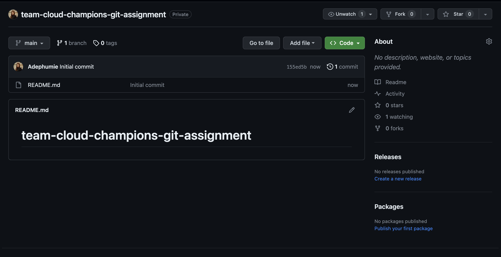
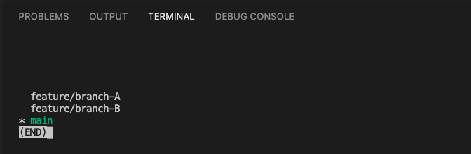
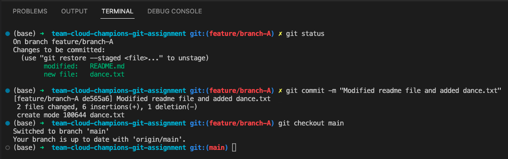
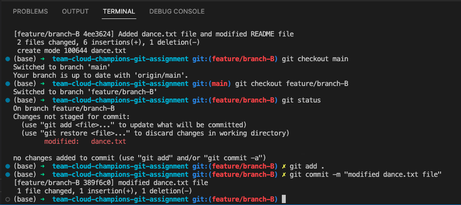
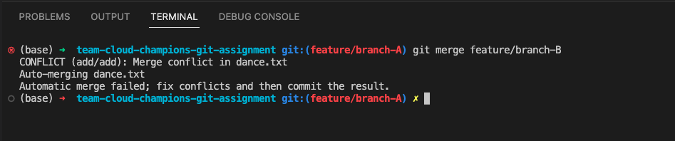
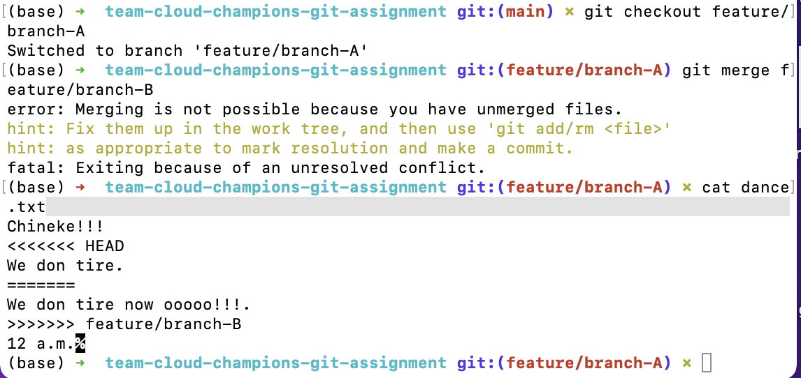
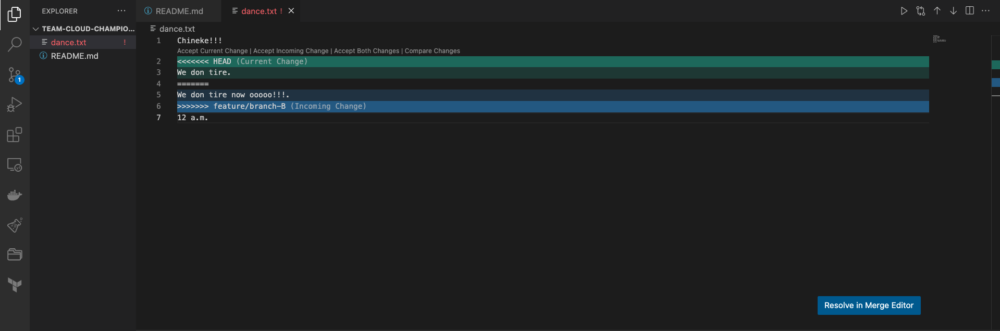
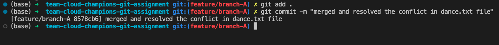
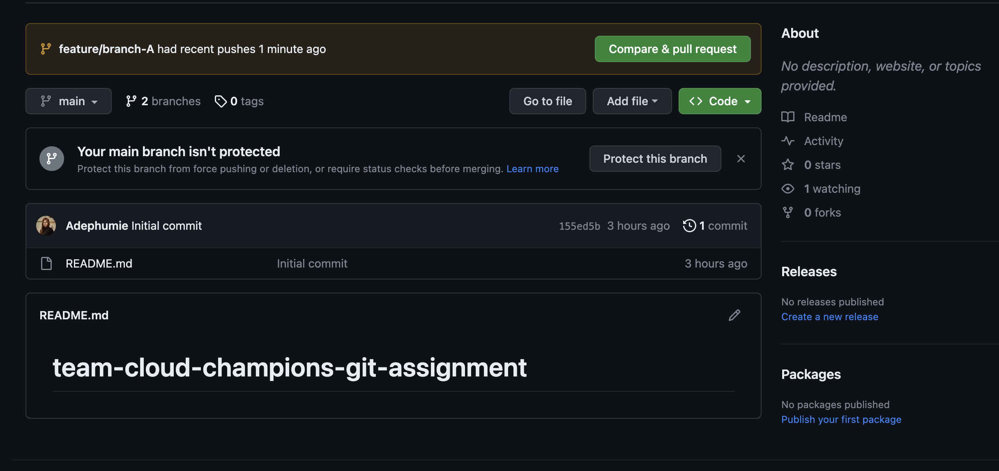

# **Teams Cloud Champions- Git** 

## **Part 1**

1. Initialzing the main repo with `README.md` file on github.
    
    *github-repo-with-`README.md`-file*

<br>

2. Clone the repo to your local machine to have a copy of what you have just created in your local environment.

    ```
    mkdir <new-directory>

    cd <new-directory>

    git clone https://github.com/username/project-name.git
    ```

<br>

3. Create two branches from the main branch: `feature/branch-A` and `feature/branch-B` with:
    
    ```
    git branch feature/branch-A

    git branch feature/branch-B

    git branch
    ```

    
    *List of branches in the repository*

<br>

4. Switch into `feature/branch-A` and make your changes.

    ```
    git checkout feature/branch-A
    ```

    This commands helps to switch into the `feature/branch-A` branch. After making these changes, add and commit to the branch.

    
        *Git add and git commit to feature/branch-A diagram*

<br>

5. Switch into `feature/branch-B` and make similar changes. Then, add something extra in one of the lines.

    
        *Git add and git commit to feature/branch-B diagram*

<br>

6. **Git Merge:** To git merge, you will `git checkout` to the branch you want to merge into and use the `git merge` command to specify the name of the branch to bring into this branch. And now, we will attempt to merge `feature/branch-B` into `feature/branch-A`.


    ```
    git checkout feature/branch-A

    git merge feature/branch-B
    ```

    
        *git-merge-error-diagram*

<br>

## **Part 2**

### **About Git Conflict:**

When multiple branches have been created or multiple developers are working on a project simultaneously, there will be a need to merge codes.Git has an automatical and easy way of merging conflicts, however, a conflict arises when two people have made changes to the same line or in our case, we have edited the same files in different branches with a difference on the same line of code.

Conflict can also arise if a developer has deleted a file while another developer was modifying it. In each on these cases, git cannot automatically determine what is correct, so it becomes a conflict.

You should also note that conflict only affects the developer conducting the merge, the rest of the team is unaware of the conflict. After git has marked the file as being conflicted, it will stop the merging process and request a manual resolving of the conflict.

Since the conflict only affects developer performing the merge thaen it's the responsibility to also resolve it.

On the terminal, git conflict error is shown with and you can `cat` the content of the file to get the below diagrams:


    *git-conflict-from-terminal*

From the diagram we can find additional contents:

- `<<<<<<< HEAD`
- `=======`
- `>>>>>>> feature/branch-B`

These are called conflict dividers.

The `=======` line shows the **`center`** of the conflict while all the contents between the center and the `<<<<<<< HEAD` line are contents that exists in the current branch (feature/branch-A) which the `HEAD` ref is pointing to.

Also, all the contents between the center and the `>>>>>>> feature/branch-B` line are those present in our `>>>>>>> feature/branch-B`.


    *Graphical-representation-of-conflict-error-on-vscode*

<br>

## **Part 3**

### **Resolving the Merge Conflict**

The most direct way of resolving a merge conflict is to edit the conflicted file. On the terminal or vscode, open the file with your preffered editor, remove the conflict dividers, and the unwanted parts of the codes.

Once the codes have been edited, use `git add` command and `git commit` to register the changes as shown below:

```
git add .

git commit -m "merged and resolved the conflict in dance.txt file"
```

    *merge-conflict-resolved-message-from-git-commit*

<br>

## **Part 4**

### Updating Remote Repository

From the terminal, use this command to push the merged feature branch `(feature/branch-A)` to Github.

```
git push --set-upstream origin feature/branch-A
```

This will create feature/branch-A in the remote repository. A pull request will be made to merge the code to the main branch.


    *pull-request*

Click on the `Compare and Pull request` button then merge the codes.


## **Git Repo Link used by Team Cloud Champions**
-   [Ada's Link](https://github.com/Ada026/learning-git-DaaS/tree/main)

-   [Adefunmi's Link](https://github.com/Adephumie/team-cloud-champions-git-assignment)


## References

1. [Git Merge Conflicts](https://www.atlassian.com/git/tutorials/using-branches/merge-conflicts#:~:text=A%20conflict%20arises%20when%20two,to%20help%20resolve%20merge%20conflicts.)
   


