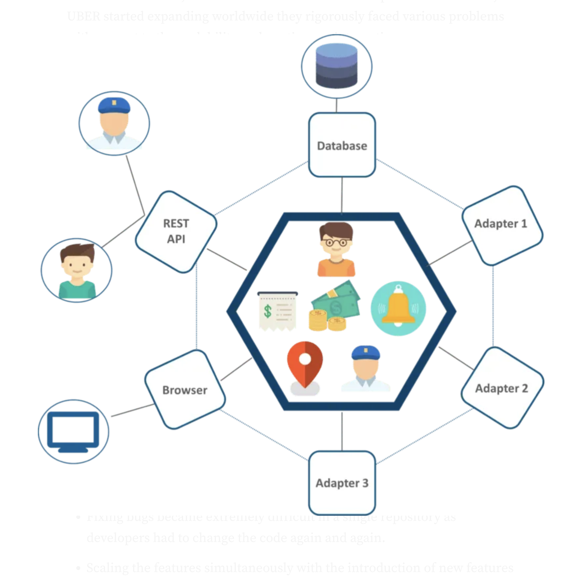
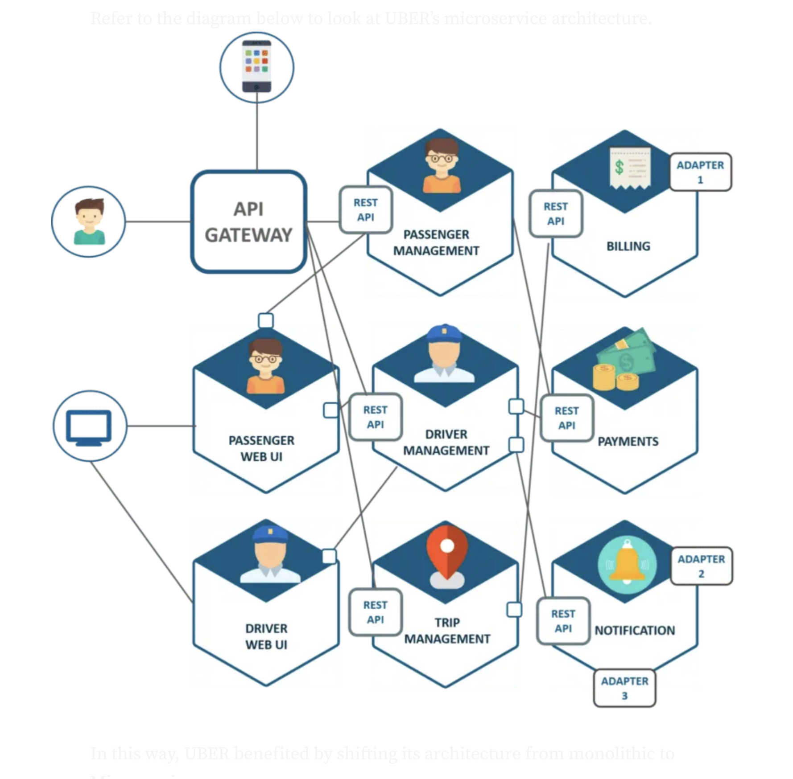
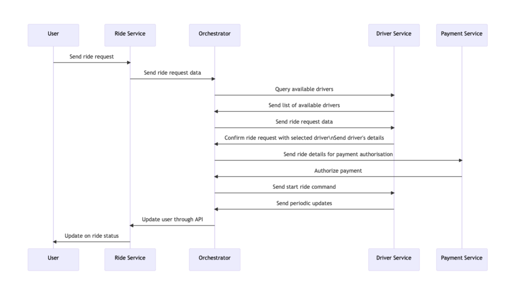

# Efemena- Teams Cloud Champion

## **Introduction**

Microservices architecture has become increasingly popular in modern software development due to its ability to break down large, complex applications into smaller, independently deployable services. In this software architecturevvd, each small independent service performs a business function. 

In this analysis, we will explore a real-world example of a microservices-based application, specifically a ride-sharing platform like Uber. We will delve into how service discovery and orchestration are implemented in this system, discussing both the challenges faced and the benefits achieved.

## **Uber's Previous Architecture and Challenges**

Like most start ups, Uber's business needs at the beginning were met with the monolithic architecture approach but with expansion came more problems regarding scalability and continuous integration.

*Uber's-monolithic-architecture-diagram*

In this architecture, the Database- storing data, Rest API where passengers and drivers connected on, and the three adapters for processing billings, payments and sending emails were all working as one system.

### **Uber's Challenges with the Architecture**

- **Scalability-** With Uber's expansion worldwide, scaling new features and making it available worldwide bacame tough.
- **Availability-** A problem to one part of the system meant the whole system would most likely be affected, thereby, causing frequent downtimes.
- **Bugs-Fixing-** As the code base and repositories became larger, it became extremely challenging for developers to fix bugs.
- **Updating features-** updating new features involved rebuilding, redloying and testing over and over again.

## **Uber's Microservice Architecture**

Having recognized the problems they had with the monolithic approach, Uber decided to break their codes into small manageable chunks as seen in Amazon, Netflix, e.t.c.

This approached enables Uber to have separate units performing different functions. In addition, features could be scaled individually.

*Uber's-microservice-architecture-diagram*

## **Service Discovery in Uber's Ride-Sharing Microservices:**

Service discovery in a ride-sharing application involves identifying and locating various microservices within the system. It enables one service find and communicate with others simply and reliably without necesarily knowing where those services run. 

This is crucial for enabling dynamic scaling, load balancing, and efficient communication between services. Typically, ride-sharing platforms implement service discovery through technologies like Kubernetes, Docker, and service registries.

### **Challenges Faced:**

1. **`Dynamic Scaling:`** One of the major challenges is handling the dynamic scaling of services based on demand. As ride requests increase, additional instances of services such as ride matching, user authentication, and payment processing need to be spawned. Implementing an automated scaling system that integrates with service discovery can be complex.

2. **`Service Failures:`** Microservices can fail due to various reasons, and service discovery must be able to detect failures and redirect traffic to healthy instances. This necessitates implementing health checks and failover mechanisms, which can be challenging to configure correctly.

3. **`Latency Management:`** Ensuring low latency is critical for a smooth user experience. Service discovery should route requests to the closest or least loaded instances of services. Achieving this effectively requires sophisticated load balancing algorithms and monitoring.

### **Benefits Achieved:**

1. **`Improved Scalability:`** Service discovery enables automatic scaling of microservices based on demand. This results in cost savings and ensures that the system can handle traffic spikes without manual intervention.

2. **`High Availability:`** By constantly monitoring the health of services, service discovery helps maintain high availability. In case of failures, traffic is redirected to healthy services, minimizing downtime.

3. **`Load Balancing:`** Load balancing, a key feature of service discovery, ensures even distribution of traffic across service instances. This optimizes resource utilization and reduces response time.

## **Orchestration in Ride-Sharing Microservices:**

Orchestration in a ride-sharing application refers to the coordination of multiple microservices to fulfill a user's ride request. Orchestration involves having a central component, called an orchestrator, that manages the flow of communication between different services. 

The orchestrator initiates and coordinates service interactions and the order and flow of messages between services. In ride sharing applications, it involves managing the sequence of actions, such as finding a driver, calculating fares, and processing payments.

*orchestration-in-ride-sharing-applications*

### **Challenges Faced:**

1. **`Complex Workflow:`** The ride-sharing process involves a series of steps, from matching a rider with a driver to calculating fares and processing payments. Orchestrating these steps seamlessly can be challenging and requires a well-defined workflow.

2. **`Consistency and Atomicity:`** Ensuring that all actions within the orchestration are completed consistently and atomically, even in the face of failures, is a critical challenge. This often requires implementing distributed transactions or compensation logic.

3. **`Scalability:`** As the number of ride requests increases, orchestrating a large number of concurrent rides can strain system resources. Efficiently orchestrating rides at scale is a continuous challenge.

### **Benefits Achieved:**

1. **`Enhanced User Experience:`** Effective orchestration leads to a smoother and more efficient ride-sharing experience for users. This includes faster matching, accurate fare calculations, and seamless payments.

2. **`Optimized Resource Utilization:`** Orchestrating services efficiently ensures that system resources are used optimally, resulting in cost savings and improved performance.

3. **`Flexibility and Agility:`** Microservices-based orchestration allows for flexibility in modifying and adding new features to the ride-sharing platform. Changes to individual services can be made without disrupting the entire system.

## **Conclusion:**
In the world of ride-sharing applications built on a microservices architecture, service discovery and orchestration play pivotal roles in ensuring scalability, high availability, and a seamless user experience. While they come with their challenges, including dynamic scaling and complex workflows, the benefits achieved, such as improved resource utilization and enhanced user experience, make them indispensable components of modern ride-sharing platforms. Properly implemented service discovery and orchestration are essential for meeting the ever-growing demands of such applications.

## **References:**

For further reading, refer to these.

1. [An Overview of Microservice Architecture Impact
in Terms of Scalability and Reliability in
E-Commerce: A Case Study on Uber and Otto.De](https://ijarsct.co.in/Paper3111.pdf)

2. [Service Discovery in a Microservices Architecture](https://www.nginx.com/blog/service-discovery-in-a-microservices-architecture/)

3. [Orchestration vs Choreography: How to Pick the Right Integration Pattern for Your Microservices in Azure](https://www.linkedin.com/pulse/orchestration-vs-choreography-how-pick-right-pattern-your-bhardwaj/)

