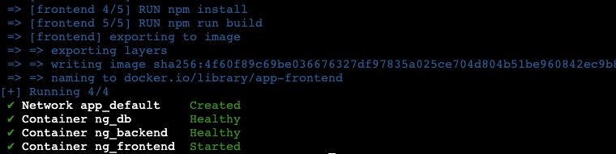

# Docker Assessment

## **Step1: Preparing the Ubuntu Server**
1. Installation of Dependencies: From the applications documentation, the developer specified having `Nodejs version 16`, `Git`, `Docker` and `Docker Compose 2.5 and higher`. So we prepared a bash script that will install all these dependencies on our Ubuntu Server.

After successful completion, we will have this message:


## **Step 2: Add Ubuntu user to Docker Group**

This is an optional step, however, because we want to seamlessly use the `docker` command without sudo (which keeps giving permission error), we decided to add the Ubuntu user to the docker group with this command:

```
    sudo usermod -aG docker ubuntu
```

Then, reboot the system to implement the change.

## **Step 3: Preparing the Repository**

1. Fork the repository from **[here](https://github.com/jaiswaladi246/fullstack-bank)** to github account.
2. Cloned the forked repository to the local environment with **`git clone`** command.
3. Change into the `fullstack-bank` directory and install the nodejs dependencies for the project with:

    ```
    npm install
    ```

This command adds a directory called `node_modules` to the application's directory.

4. On completion, change into the `app` directory, where the `docker-compose.yml` file is located, and run the following command to pull the containers and run them on the machine.

    ```
    docker compose up -d
    ```

5. The command ran above will spin up three containers:

- ng_frontend - mapped on the port 3000.
- ng_backend - mapped on the port 3001.
- ng_db - mapped on the port 3002.


  
The containers are for the front-end, back-end and database, respectively. After the containers start running, you can enter the http://<localhost>:3000 address in your browser to see the application running.

However, Because this is on an AWS EC2 instance, the URL becomes:

`http://<public-IP-address>:3000`


## **Step 4: Inspecting the Images**  

At this stage, we bacame more interested in the images used to guild this app, and we got these, using the `docker images` command.


The output gave us very heavy docker images.

To stop the containers from running, use:

```
docker compose down
```


## **Step 5: Creating and Building multi-stage Dockerfile for Frontend**

Navigating into the `fullstack-bank/app/frontend` directory, we made a file called `Dockerfile.prod` to hold our new multistage code.


And to build the frontend image, we used this command:

```
docker build -t app-frontend:latest -f Dockerfile.prod .
``` 

## **Step 6: Creating and Building multi-stage Dockerfile for Backend**

Navigating into `fullstack-bank/app/backend` directory, we also created the `Dockerfile.prod` file and added these lines of code:


Built the Image with:

```
docker build -t app-backend:latest -f Dockerfile.prod .
```

We left the DB as it was.

`Docker images` command gave us this:


## **Step 7: Create a Docker Hub Account**

We went on to create a group's account on Docker hub to hold our images. 

## **Step 8: Tag the images and Push to the Docker Registry.**

We tagged the frontend images to include the username on Docker Hub like this:

```
docker tag app-frontend:latest teamcloudchampions/frontend:cloud
```

And the bcakend became this:

```
docker tag app-backend:latest teamcloudchampions/backend:cloud
```

To push the images to Docker hub, we used the following commands to first authenticate and eventually push the images:

```
docker login -u teamcloudchampions

docker push teamcloudchampions/frontend:cloud

docker push teamcloudchampions/backend:cloud
```

On pushing the codes, we got these images in our repo:


## **Step 9: Editing `docker-compose.yml` file.**

The `docker-compose.yml` file became this:

```
version: '3.5'

services:
  frontend:
    container_name: ng_frontend
    image: teamcloudchampions/frontend:cloud
    build: ./frontend
    ports:
      - 3000:3000
    platform: linux/x86_64
    working_dir: /
    depends_on:
      backend:
        condition: service_healthy
    environment:
      - NEXT_PUBLIC_API_URL=http://localhost:3001
    healthcheck:
      test: ["CMD", "lsof", "-t", "-i:3000"]
      timeout: 10s
      retries: 5

  backend:
    container_name: ng_backend
    image: teamcloudchampions/backend:cloud
    build: ./backend
    ports:
      - 3001:3001
    platform: linux/x86_64
    working_dir: /
    depends_on:
      db:
        condition: service_healthy
    environment:
      - APP_PORT=3001
      - JWT_SECRET=jwt_secret
      - DB_USER=postgres
      - DB_PASS=123456
      - DB_HOST=db
      - DB_PORT=5432
    healthcheck:
      test: ["CMD", "lsof", "-t", "-i:3001"]
      timeout: 10s
      retries: 5

  db:
    container_name: ng_db
    image: postgres:15.1
    platform: linux/x86_64
    ports:
      - 3002:5432
    user: postgres
    environment:
      - POSTGRES_PASSWORD=123456
    restart: 'always'
    healthcheck:
      test: ["CMD-SHELL", "pg_isready", "-d", "db_prod"]
      timeout: 10s
      retries: 5
```

And then, `docker-compose up` command.


## **Challenges:**

Some of the challenges we faced were: 

- Understanding the code base and getting the build stage and runtime environment of the application that can be copied into the second stage of the Dockerfile. 

## **References**

- [Dockerfile Documentation](https://docs.docker.com/engine/reference/builder/)
- [Docker Classwork](https://bitbucket.org/daasdotng/daas.docker/src/develop/)
- [Distroless Github](https://github.com/GoogleContainerTools/distroless)


