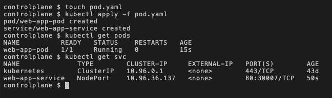
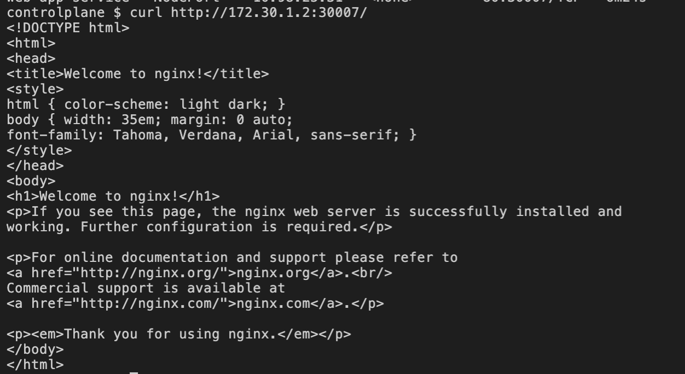
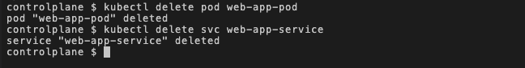
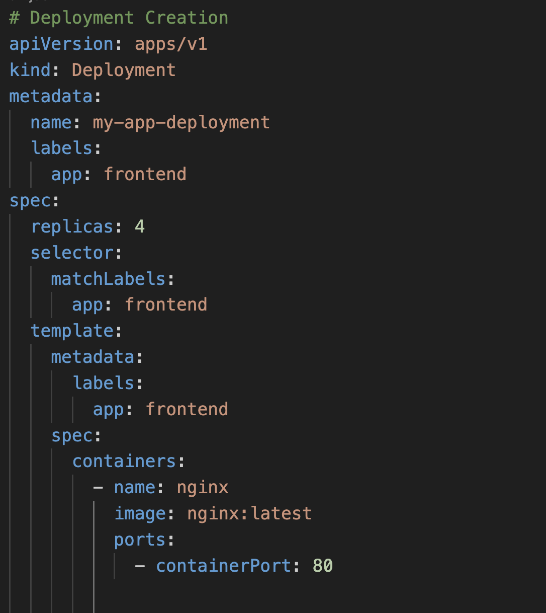
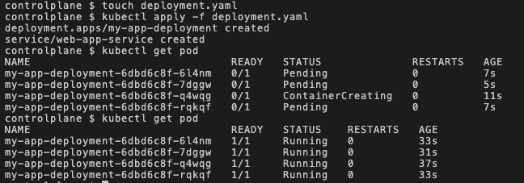
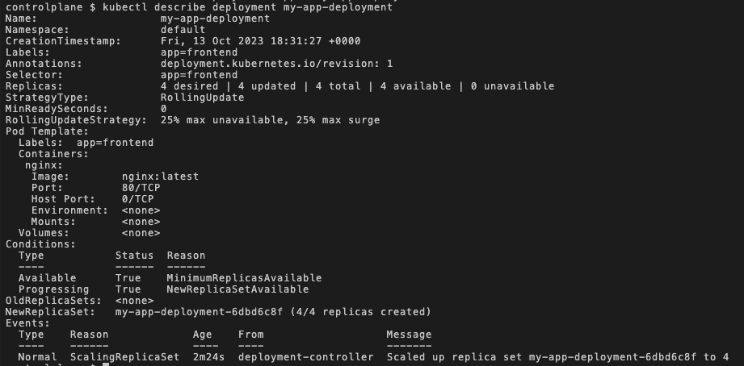
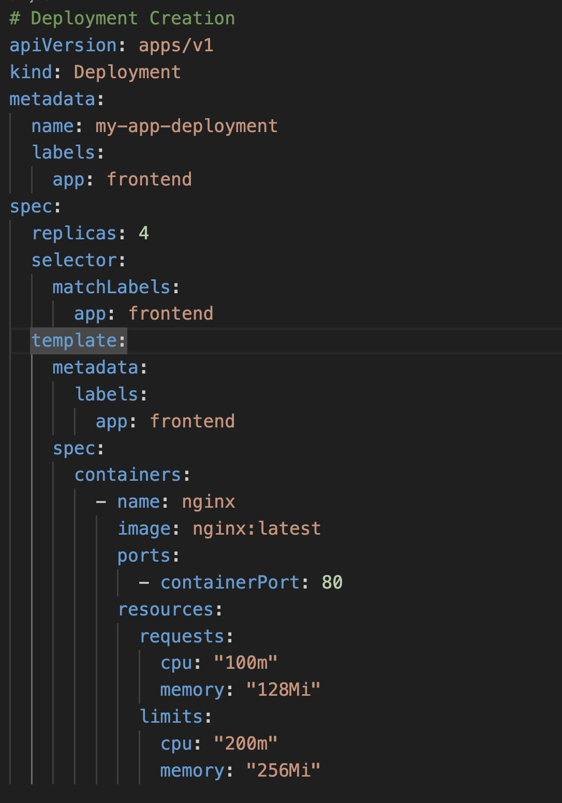
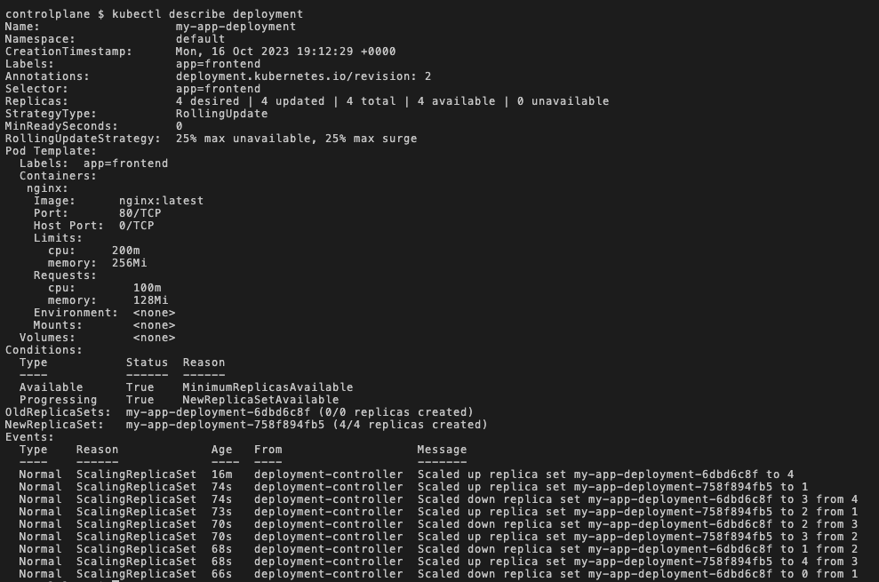

# **Kubernetes Assignment**

## ***Question 1***

1. Write out a yaml file named "pod.yaml" that will create a pod named "web-app-pod", and also add a configuration for creating a nodePort service called "web-app-service" as seen [here](./pod.yaml).

   
2. Create the pod and service by using this command:
   
    ```
    kubectl apply -f pod.yaml
    ```

    Output:

    


3. Access the web app by using:
   
    ```
    curl <ip-address>:30007
    ```
    
    

    To get the IP address of the server, use this command on the terminal:

    ```
    ip addr
    ```

    

    In this case, the IP address is the one found on the second list.

4. Delete the pod and service created with this command:
   
   ```
   kubectl delete pod web-app-pod
   
   kubectl delete svc web-app-service
   ```

   

>
## ***Question 2***

1. Create a deployment file called ["deployment.yaml"](./deployment.yaml) to create a deployment, called "my-app-deployment" with 4 replica sets of the pod and use the commands below to create and descibe it:

    
   
   ```
   kubectl apply -f deployment.yaml

   kubectl describe deployment my-app-deployment
   ```

   ### Create Deployment
   

   ### Describe Deployment
   

   In this deployment description, We found the Namespace it was created in (default), creation timestamp, Strategy type (Rolling update), etc. However, there is no value stated for the resource request and limits.

2. Edit the deployment file to add the resources request and limit configuration to the container properties as shown:

    

    ### Describe deployment
    


