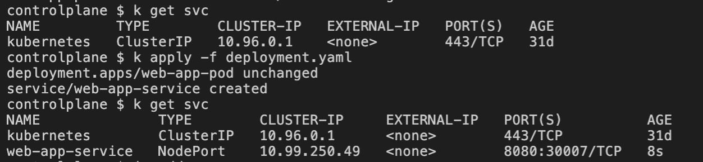

# **Kubernetes Assignment**

1. Write out deployment's yaml manifest that will create pods, replicasets, and nodePort service as seen [here](./deployment.yaml).
   
2. Create the resources by using this command:
    ```
    kubectl apply -f deployment.yaml
    ```

    Output:

    

    

3. Access the web app by using:
    ```
    curl <ip-address>:30007
    ```
    
    

    To get the IP address of the server, use this command on the terminal:

    ```
    ip addr
    ```

    

    In this case, the IP address is the one found in the second list.

