# **TeamCity CI Configuration**
Assessment 2

1. We set up a repository on this [URL](https://github.com/Team-Cloud-Champions/fullstack-bank) holding our application. 
2. We were having memory issues with setting up Servers, so we decided to go with the Teamcity Cloud Option to save time.

## Setting up TeamCity Cloud
- On [TeamCity's Website](https://www.jetbrains.com/teamcity/), scroll down to TeamCity Cloud and click on Github logo for authentication through Github.

    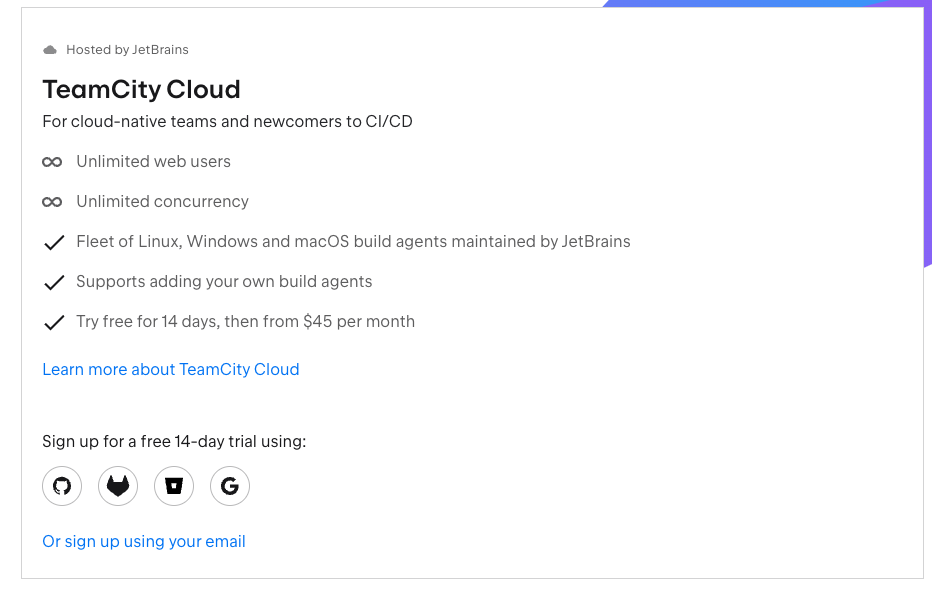

- Then, create a domain name:
    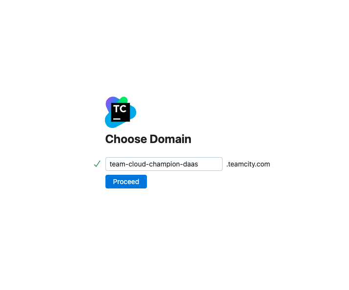

- You will be redirected to a URL holding the domain name you registered and then proceed to accept the agreement. This will bring you to the TeamCity's welcome page.
    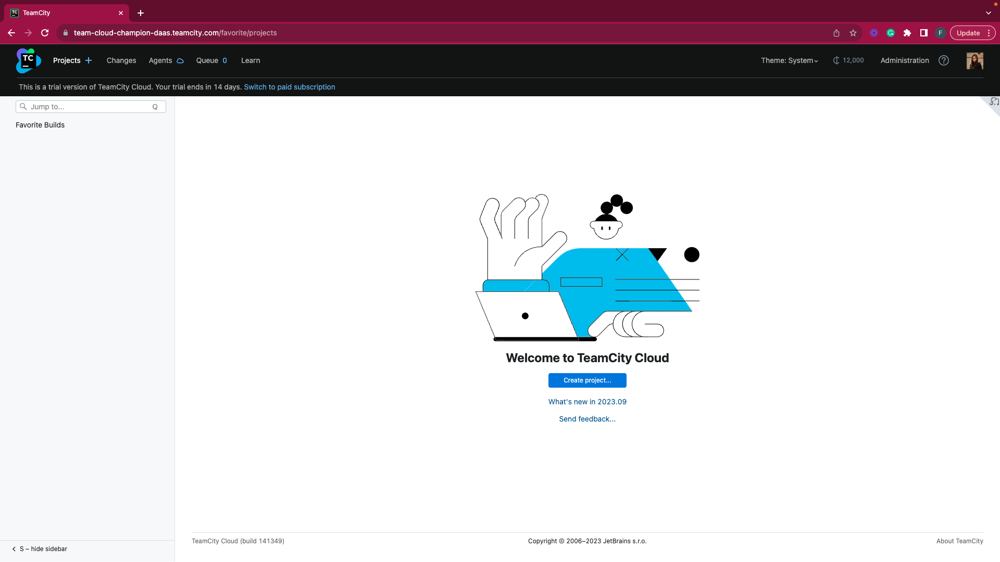
  
- Click on **`Create Project`**, and fill the form with the necessary details as shown below.
    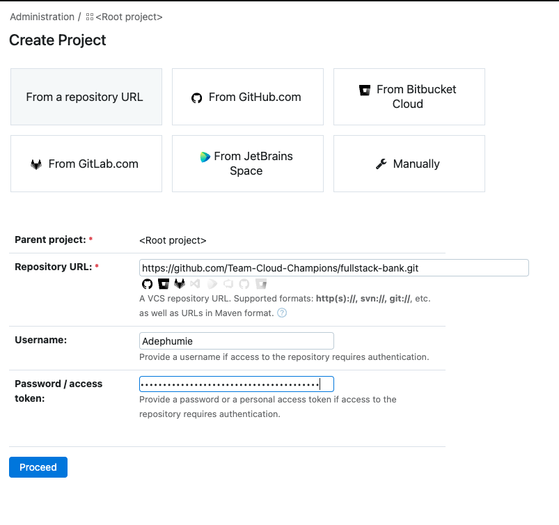

- Click on **`proceed`** and on the next page, leave the default settings.
    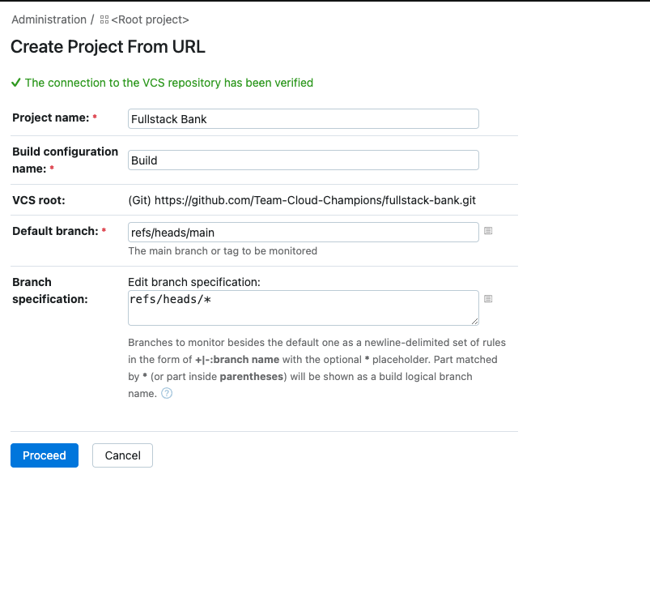

- Add steps to the pipeline configurations
- We filled the next page like this:
    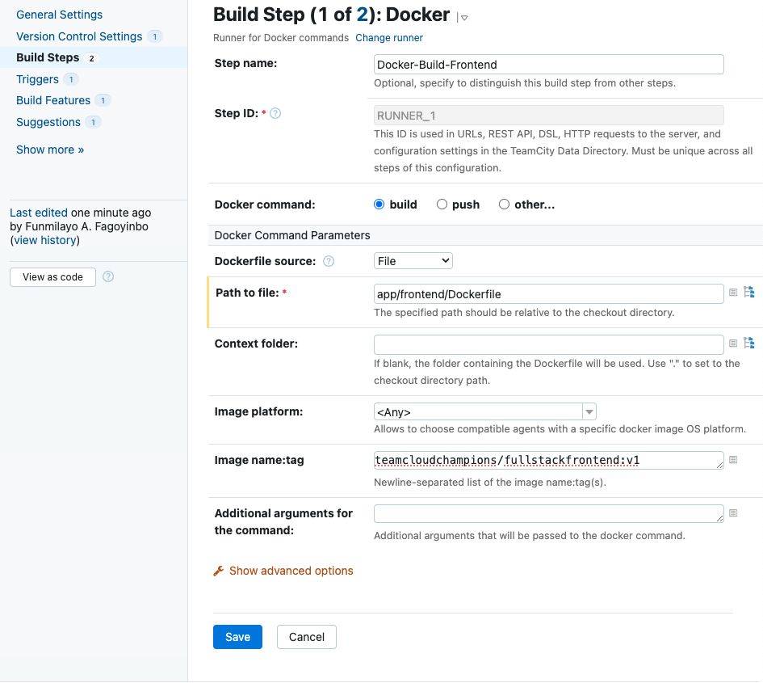
    

- Add the push step for the front end and backend as shown
    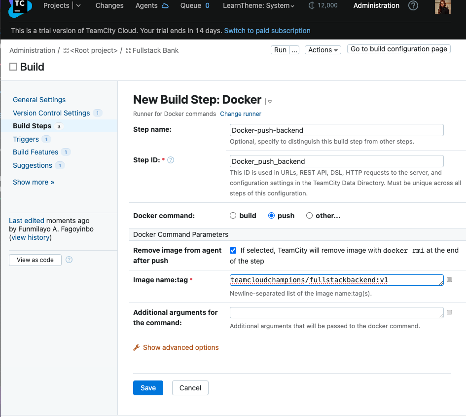

    At the end, we got four steps in our build step configuration as shown below:

    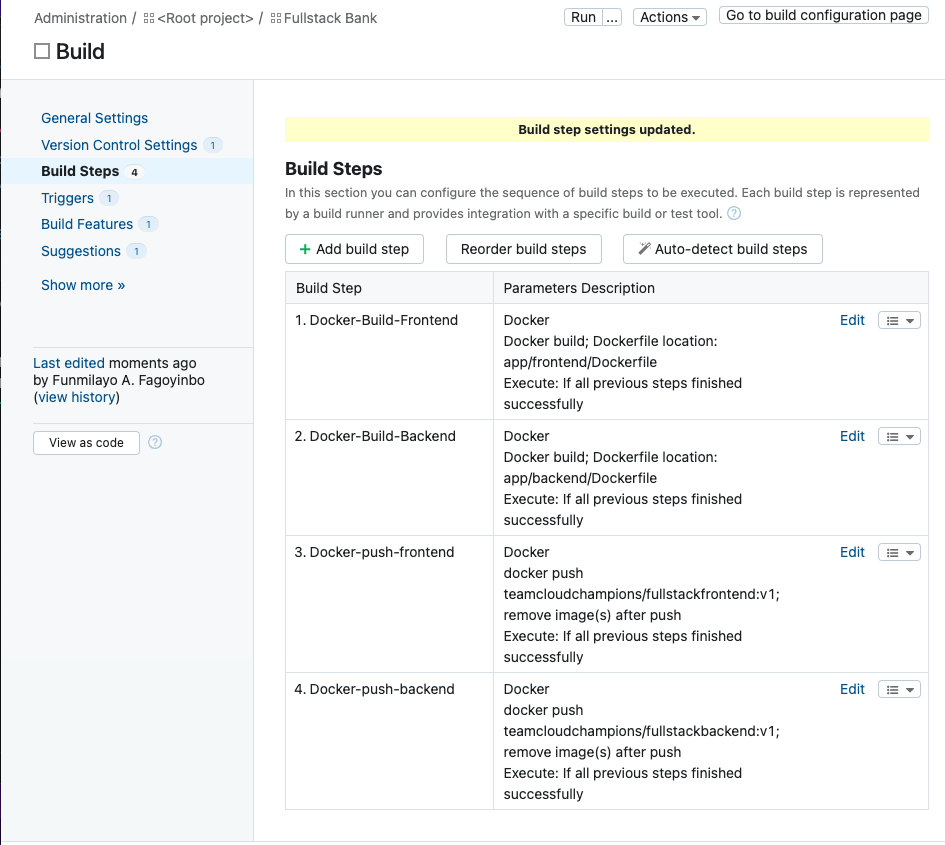

### Setting Docker parameters

Click on the name of the project on the top of the page, ours is **`Fullstack-Bank`** and on the left-hand-side, click on `Show more` and click on Connection.

Pick the Docker registry option and input your values.

## Build Feature for Docker Support 
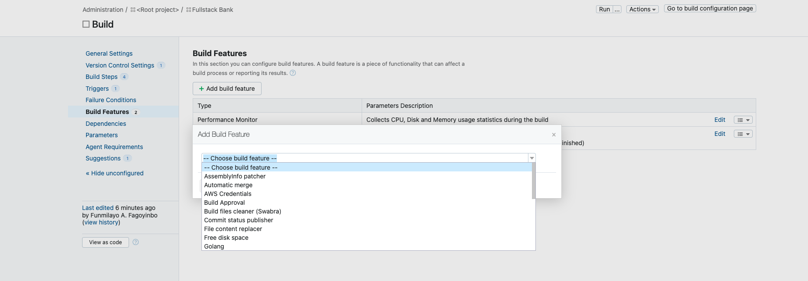
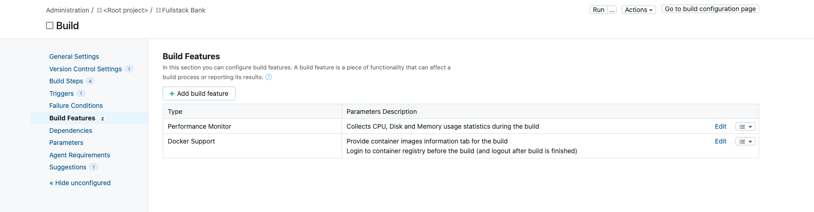

This is to add to the Docker infrastructure.

We also edited our image tags to use the buildnumber variable to have distinct images after every run.

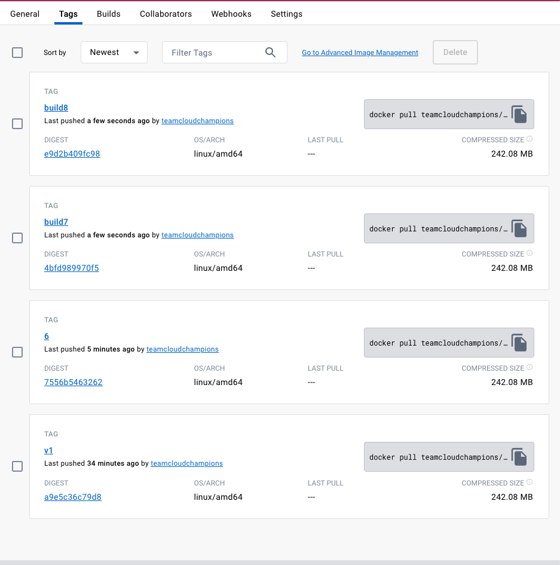

