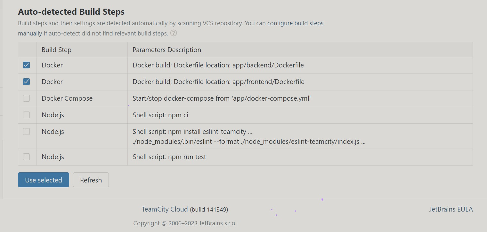

# **TeamCity CI Configuration**
## Assessment 2

1. We set up a repository on this [URL](https://github.com/Team-Cloud-Champions/fullstack-bank) for our application. 
2. Due to the memory issues we wwere having with setting up Servers, we decided to go with the Teamcity Cloud Option to save time.

## Setting up TeamCity Cloud
- On [TeamCity's Website](https://www.jetbrains.com/teamcity/), scroll down to TeamCity Cloud and click on the GitHub logo for authentication through GitHub.

    

- Then, create a domain name:
    

- You will be redirected to the domain's name URL that you registered, then proceed to accept the agreement on the Terms and Conditions page. This will bring you to the TeamCity's welcome page.
    
  
- Click on **`Create Project`**, and here, you will add the repository's URL, Username, and Personal Access Token for authentication. 
  
  This process helps to set up the Version Control System that we want TeamCity to monitor. Fill in the form with the necessary details as shown below.
    

- Click on **`proceed`** and on the next page, leave the default settings, since we are working with just one branch which is also the default one (main branch).
    

## Setting Up the Build Steps
- In this next step, TeamCity Cloud automatically,  generated some Build steps as shown below:
    

- Then, we selected two of them that we need as shown below and clicked on `Use selected`:
    

- On the next page, we picked each selected step (Docker for frontend and Backend) to edit. we set the `Step name`, and added the `image name:tag` as shown below:
    
    

- Then, on the **`Build step`** page, because we still needed two more steps for pushing the images, we clicked on **`Add build step`** as shown here:
    

- On the next page, click on `Docker` as the runner for that step as shown:
    

- On the New build docker step that we have chosen, we will fill in the form as shown below. Input the step name, pick the push option for Docker command, and add the image name:tag, the save. Do this for the frontend and backend.
    
    

    At the end, we got four steps in our build step configuration as shown below:

    

## Setting Docker parameters
- After defining the build steps, our next configuration will be for the connection. Click on the name of the project on the top of the page, ours is **`Fullstack-Bank`** and on the left-hand-side, click on `Show more` and click on `Connection`. 
    

- Then on the next page, Click on `Add connection`, and then, `connection type`:
    

- Pick the `Docker Registry` option and input your Dockerhub credentials.
    

- Then, Click on `Test Connection` to verify that Dockerhub has been integrated with Teamcity.
    

## Build Feature for Docker Support 

- On the left-hand side of the Build steps page, click on **`Build Features`**, then **`Add build features`**. Pick the **`Docker Support`** option.

- After picking **`Docker Support`**, you should have this image:

Then, click, **`run`**. This image shows a list of builds that we ran.
    

We also edited our image tags to use the **`env.BUILDNUMBER`** variable to have distinct images after every run. This was set in the build steps where we set the **`image name:tag`** previously.

