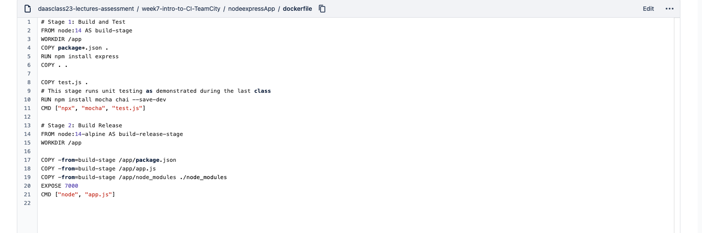
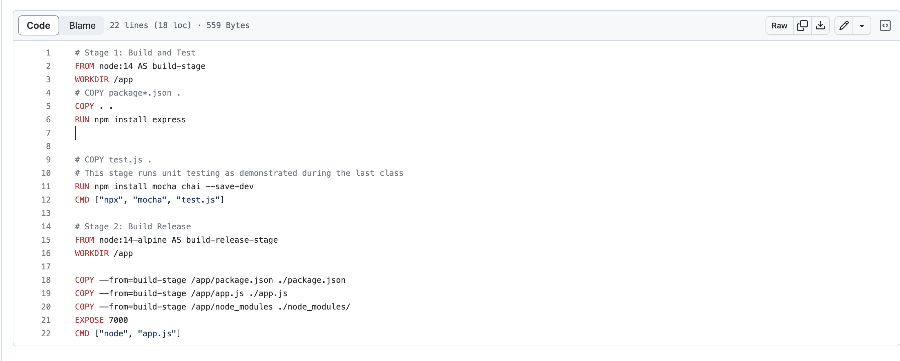
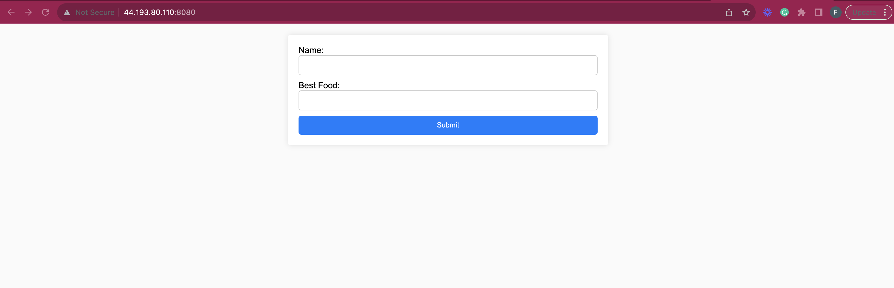

# Solution to the second task.

1. The codes were added to the repository.
2. The old dockerfile was edited from this state:
    

    To become this:

    

## Explanation of the Edited Dockerfile
1. We commented out lines 4 and 9 in the old Dockerfile because it was contradicting the `copy all` command on line 6. Then we moved the `copy . . ` on line 6 to the line just before the `RUN npm install express` command.
    
2. On lines `17`, `18`, and `19` of the old dockerfile, the `-from=build-stage` became `--from=build-stage` which is the right syntax for the multi-stage dockerfile.

3. On the same lines `17` and `18`, because the dockerfile had more than one `COPY` command, it required us to specify the destination folder to paste the files.

4. We also added a forward slash in front of `./node_modules`.

Then, to build the image:

```
docker build -t nodeexpressapp:v1 .
```

To run the app:

```
docker run -d -p 8080:7000 nodeexpressapp:v1
```

To access the web application:

`http://<IP-ADDRESS>:8080`


